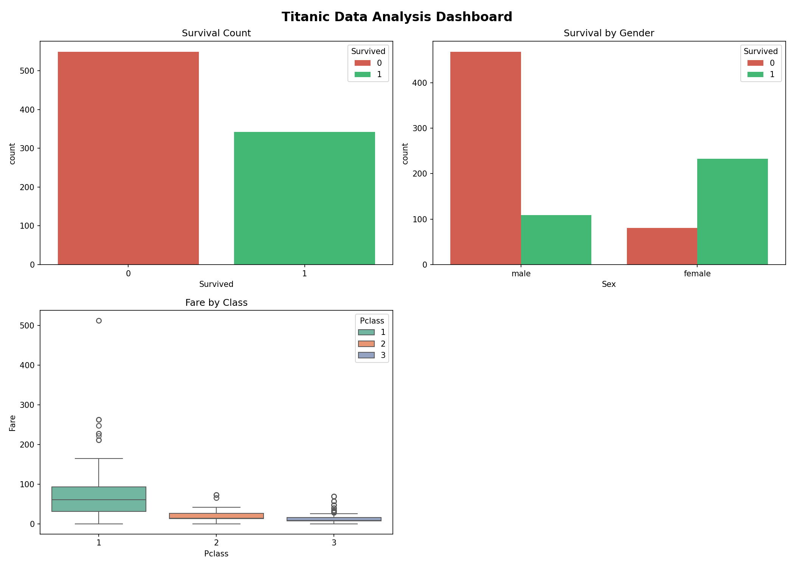
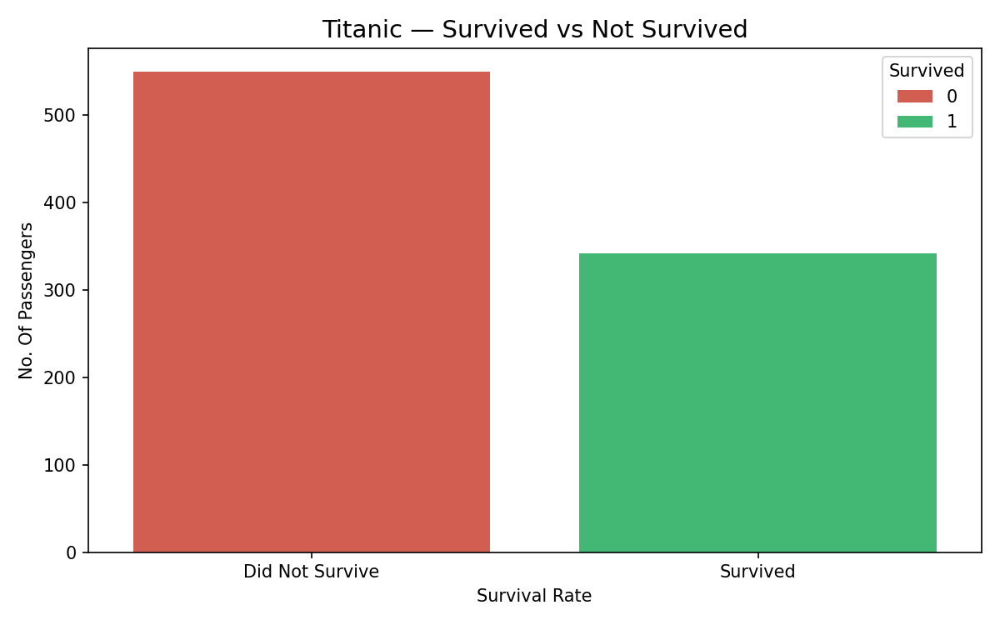
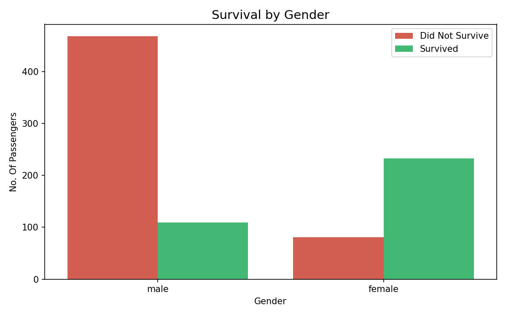
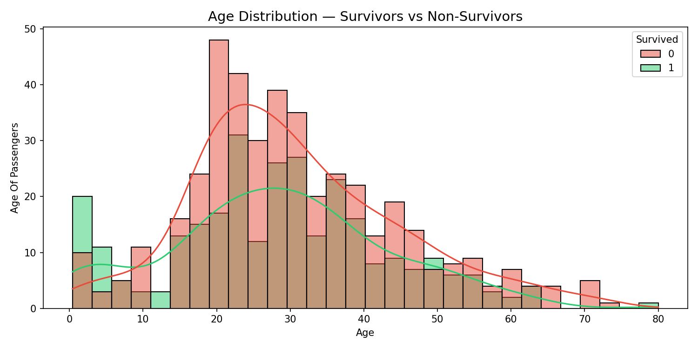
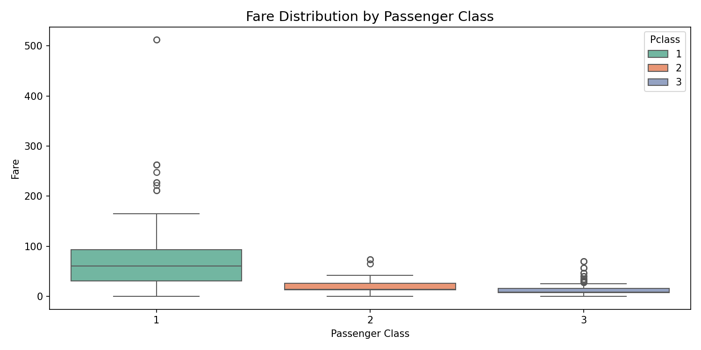

# CodeAlpha Data Analytics Internship - Task 2
# Data Visualization on Titanic Dataset

This folder contains the second task for the CodeAlpha Data Analytics Internship. The goal of this project is to create impactful data visualizations using the classic Titanic dataset to reveal insights clearly and support data-driven decision-making.

## 📌 Project Overview
This project transforms raw data into visual formats like charts and graphs. By visualizing demographics, ticket fares, and survival rates, we craft compelling data stories that enhance our understanding of the passenger manifest and the tragic event.

## 📊 Key Visualizations & Insights
* **Survival Count:** A bar chart illustrating the overall survival rate, showing the stark contrast between survivors and those who perished.
* **Gender vs Survival:** A grouped bar chart highlighting the "Women and children first" protocol, clearly showing significantly higher survival rates among female passengers.
* **Age Distribution:** A histogram with a KDE overlay that compares the age distribution of survivors versus non-survivors, showing a higher survival rate for young children.
* **Fare Distribution by Class:** A boxplot revealing the socio-economic disparities, showing how ticket fares varied across different passenger classes and identifying outliers in the first class.

## 📈 Visual Analysis
All generated visualizations are stored in the `charts` directory. Below is the comprehensive dashboard and individual insights:

### Titanic Data Analysis Dashboard


### Individual Insights
**Survival Rate Overview:**


**Survival by Gender:**


**Age Distribution of Passengers:**


**Socio-Economic Spread (Fare by Class):**


## 🛠️ Tech Stack & Libraries Used
* **Language:** Python
* **Environment:** Jupyter Notebook
* **Libraries:** `pandas`, `numpy`, `matplotlib`, `seaborn`

## 🚀 How to Run Locally

1. **Clone the repository:**
```bash
   git clone [https://github.com/AnujKumarTiwari/CodeAlpha_ProjectName.git](https://github.com/AnujKumarTiwari/CodeAlpha_ProjectName.git)
   cd CodeAlpha_ProjectName/Task_2
